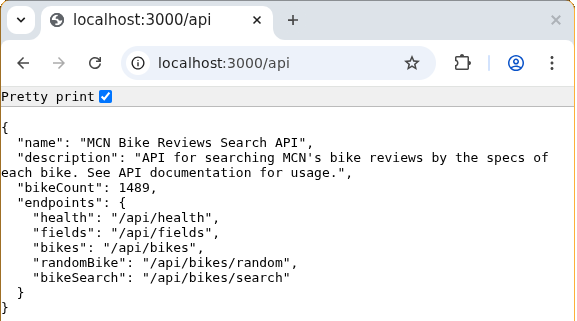

# MCN Bike Reviews Search

A backend API and editorial workflow tool for searching MCN's bike review
archive by technical specifications.

MCN writers previously had no fast way to find bikes matching criteria such as
seat height, power, price, fuel economy, or running costs. This project turns
1,489 published bike reviews into a searchable dataset, reducing recurring
editorial research from hours to minutes.

## At A Glance

- Built around a real editorial need identified while working at MCN.
- Provides a JSON API for filtered search, sorting, pagination, metadata,
  individual bike lookup, and random bike discovery.
- Validates nested filters, operators, fields, sort direction, clause limits,
  malformed JSON, and oversized request bodies.
- Includes automated tests and documentation for users, developers, and
  business stakeholders.
- Started as an Elisp prototype built in 24 hours, then developed into a
  standalone Clojure backend service with editorial and IT backing.



## Example Search

Find bikes with a seat height below 800mm, sorted from lightest to heaviest:

```sh
curl --request POST http://localhost:3000/api/bikes/search \
  --header "Content-Type: application/json" \
  --data '{
    "filter": {
      "type": "comparison",
      "field": "seat-height",
      "op": "<",
      "value": 800
    },
    "sort": {
      "field": "bike-weight",
      "direction": "asc"
    },
    "limit": 3
  }'
```

The API returns matching bike details and result counts as JSON:

```json
{
  "results": [
    {
      "bikeName": "example-bike",
      "seatHeight": "780mm",
      "bikeWeight": "135kg",
      "url": "https://www.motorcyclenews.com/bike-reviews/..."
    }
  ],
  "count": 1,
  "totalMatches": 1
}
```

## Run Locally

Prerequisites:

- Java 11 or later
- [Clojure CLI](https://clojure.org/guides/install_clojure)

Clone the repository and start the API:

```sh
git clone https://github.com/musicnark/mcn-bike-reviews-search.git
cd mcn-bike-reviews-search
clojure -M:api
```

The server starts at `http://localhost:3000`. Check it with:

```sh
curl http://localhost:3000/api/health
```

Run the automated test suite with:

```sh
clojure -X:test
```

## Architecture

```text
MCN sitemap
    -> asynchronous page-fetch pipeline
    -> HTML/specification parser
    -> local EDN cache
    -> query and validation layer
    -> Ring/Jetty JSON API
```

See the [architecture overview](docs/concepts/architecture.md) and
[design decisions](docs/concepts/design-decisions.md) for more detail.

## Technology

- Clojure
- Ring and embedded Jetty
- core.async
- Cheshire JSON
- Enlive HTML parsing
- Kaocha automated tests
- Git and Markdown documentation

## Project Status

The backend API is functional and tested. It supports the core editorial
search workflow and is suitable for local use and demonstration.

Current work focuses on deployment polish, improving data quality, and
developing a browser-based interface. The original Elisp prototype is retained
under [`archive/`](archive/) to show the project's evolution.

## What I Learned

This project pushed me beyond workflow scripting into backend service design.
It required me to turn a loosely defined business need into a usable tool,
design a public API, validate complex user input, handle imperfect source data,
write automated tests, and document decisions for technical and non-technical
readers.

## Documentation

- [Documentation index](docs/README.md)
- [API reference](docs/reference/api.md)
- [Editorial workflows](docs/how-to/editorial-workflows.md)
- [Business pitch](docs/business-pitch.md)
- [Problem space](docs/concepts/problem-space.md)
- [Roadmap](docs/roadmap.md)
- [Contributing](docs/CONTRIBUTING.md)

## Licence

This project is available under the terms in [LICENSE](LICENSE).
